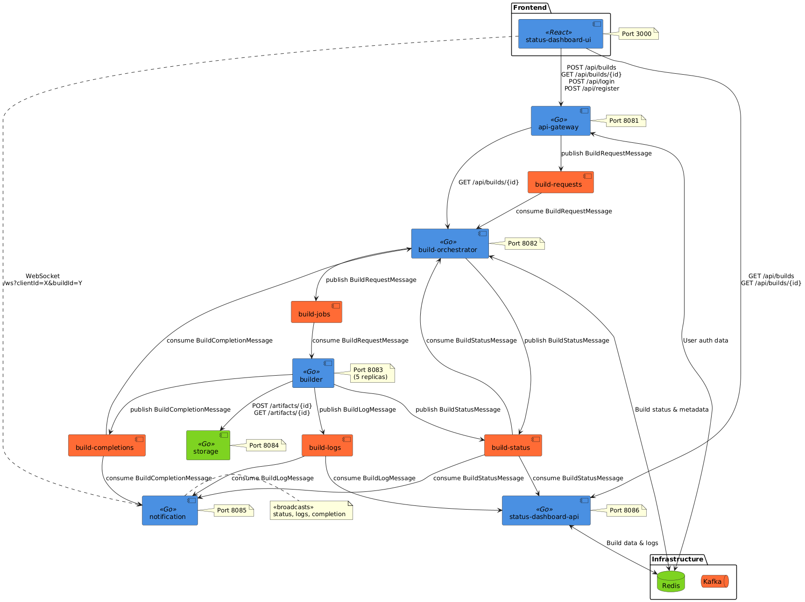

# GoBuild

GoBuild ist ein verteiltes Build-System für die automatisierte Erstellung und Bereitstellung von Anwendungen, entwickelt mit Go und Docker Compose.



## Architektur

Das System besteht aus sechs Mikroservices:
- API Gateway: Eingangspunkt für Client-Anfragen
- Build Orchestrator: Verwaltet Build-Jobs und deren Planung
- Builder: Führt Build-Prozesse aus
- Storage: Verwaltet Build-Artefakte und Logs
- Notification: Behandelt Statusaktualisierungen und Benachrichtigungen
- Status Dashboard: Bietet eine Benutzeroberfläche zur Überwachung von Builds

## Technologien

- Backend: Go (Golang)
- Frontend: React mit shadcn/ui Komponenten
- Nachrichtenwarteschlange: Apache Kafka
- Caching: Redis
- Containerisierung: Docker und Docker Compose

## Komponenten im Detail

### Build Orchestrator
Verwaltet den Build-Prozess, verarbeitet Build-Anfragen und verfolgt den Status von Builds. Verwendet Kafka für die Kommunikation mit anderen Diensten und Redis zur Speicherung von Build-Statusinformationen.

### Builder
Führt die eigentlichen Build-Prozesse aus. Unterstützt verschiedene Projekttypen (Node.js und Go) und erstellt Build-Artefakte. Sendet Logs während des Build-Prozesses.

### Storage
Speichert und verwaltet Build-Artefakte. Bietet HTTP-Endpunkte zum Hochladen und Herunterladen von Artefakten.

### Notification
Verarbeitet Statusaktualisierungen und sendet Benachrichtigungen über WebSockets an verbundene Clients.

### Status Dashboard API
Stellt API-Endpunkte bereit, um Build-Informationen abzurufen. Verwendet Redis zur Speicherung und zum Abruf von Build-Informationen.

### Status Dashboard UI
Bietet eine Benutzeroberfläche zur Überwachung von Builds und zum Anzeigen von Build-Logs und -Artefakten.

## Erste Schritte

### Voraussetzungen

- Docker und Docker Compose
- Git

### Einrichtung und Ausführung

1. Repository klonen:
```bash
git clone https://github.com/fx64b/gobuild.git
cd gobuild
./build.sh
```

Redpanda (Für das Debugging von Kafka-Nachrichten):
```bash
docker run --network=host -e KAFKA_BROKERS=localhost:9092 -e SERVER_PORT=8089 docker.redpanda.com/redpandadata/console:latest
```

Dann besuchen Sie: [Redpanda Console](http://[::1]:8080/overview)
